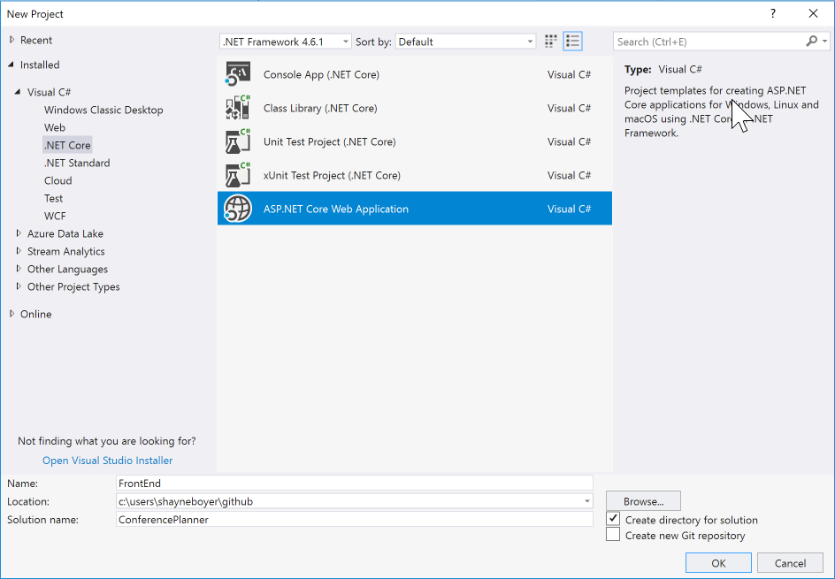
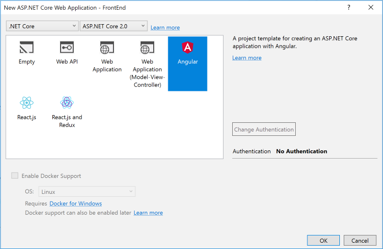
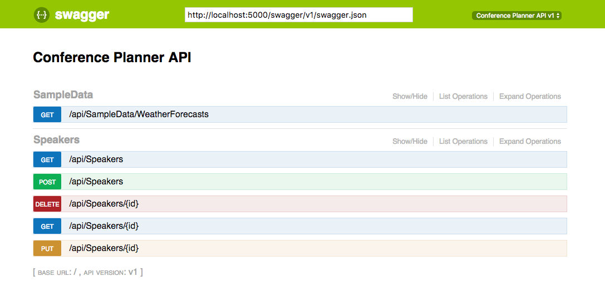
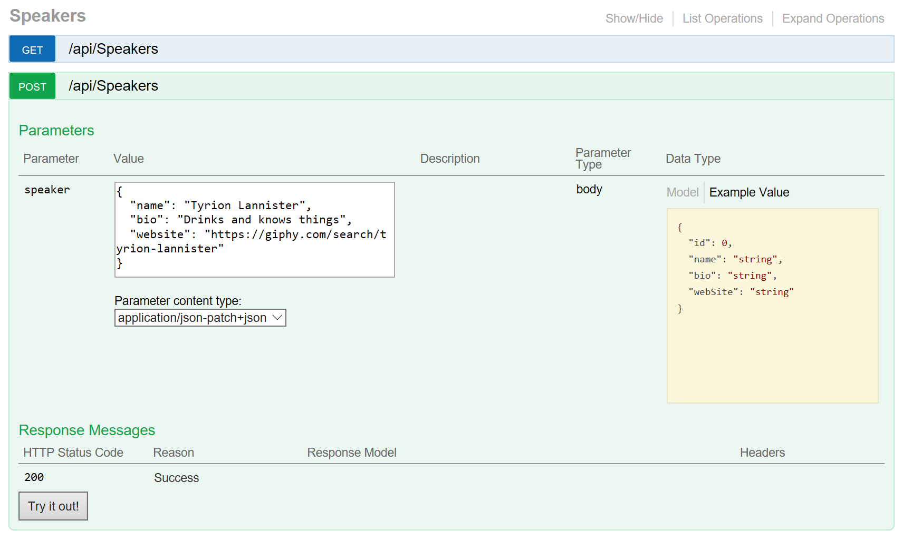
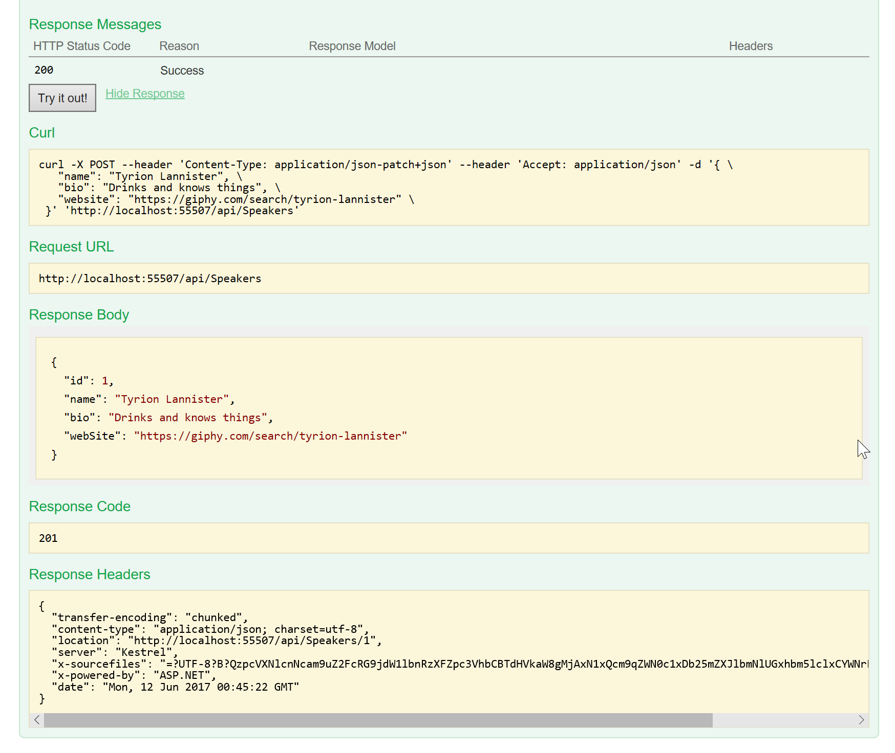

# Creating an Angular App

## Option #1: CLI and Visual Studio Code

Create a solution file to contain the projects created in the labs.
*-n spcifies the name of the solution file, -o specifies the folder name to create the content.

``` bash
dotnet new sln -n ConferencePlanner -o ConferencePlanner
```

Create the new angular application in the **ConferencePlanner** directory

``` bash
dotnet new angular -n FrontEnd -o ConferencePlanner/FrontEnd
```

Finally, add the **FrontEnd** app to the sln.

``` bash
cd ConferencePlanner
dotnet sln add FrontEnd/FrontEnd.csproj
```

## Option #2: Using Visual Studio

1. Create a new project using File / New / ASP.NET Core Web Application. Select the Angular template, No Auth, no Docker support.
   
   

1. Add a new `Models` folder to the root of the application.
1. Add a new `Speaker` class using the following code:
    ```csharp
    using System;
    using System.Collections.Generic;
    using System.ComponentModel.DataAnnotations;
    using System.Linq;
    using System.Threading.Tasks;

    namespace FrontEnd.Models
    {
        public class Speaker
        {
           public int ID { get; set; }

           [Required]
           [StringLength(200)]
           public string Name { get; set; }

           [StringLength(4000)]
           public string Bio { get; set; }

           [StringLength(1000)]
           public virtual string WebSite { get; set; }
        }
    }
    ```
1. Next we'll create a new Entity Framework DbContext. Create a new `ApplicationDbContext` class in the `Models` folder using the following code:
    ```csharp
    using Microsoft.EntityFrameworkCore;
    using Microsoft.EntityFrameworkCore.Infrastructure;
    using Microsoft.Extensions.DependencyInjection;

    namespace FrontEnd.Models
    {
        public class ApplicationDbContext : DbContext
        {
            public ApplicationDbContext(DbContextOptions<ApplicationDbContext> options)
                : base(options)
            {

            }

            public DbSet<Speaker> Speaker { get; set; }
        }

        public class ApplicationDbContextFactory : IDesignTimeDbContextFactory<ApplicationDbContext>
        {
            public ApplicationDbContext CreateDbContext(string[] args) =>
                Program.BuildWebHost(args).Services.CreateScope().ServiceProvider.GetRequiredService<ApplicationDbContext>();
        }
    }
    ```
1. Add a connection string to the appSettings.json file for this database:

    ```json
    {
        "ConnectionStrings": {
            "DefaultConnection": "Server=(localdb)\\mssqllocaldb;Database=aspnet-FrontEnd-931E56BD-86CB-4A96-BD99-2C6A6ABB0829;Trusted_Connection=True;MultipleActiveResultSets=true"
        },
        "Logging": {
            "IncludeScopes": false,
            "LogLevel": {
                "Default": "Warning"
            }
        }
    }
    ```

## Register the DB Context Service

1. Add the following code to the top of the `ConfigureServices()` method in `Startup.cs`:
    ```csharp
    services.AddDbContext<ApplicationDbContext>(options =>
    {
        if (RuntimeInformation.IsOSPlatform(OSPlatform.Windows))
        {
            options.UseSqlServer(Configuration.GetConnectionString("DefaultConnection"));
        }
        else
        {
            options.UseSqlite("Data Source=conferences.db");
        }
    });
    ```
    >This code registers the `ApplicationDbContext` service so it can be injected into controllers. Additionally, it configures operating system specific database technologies and connection strings.

## Configuring EF Migrations
1. Add the `Microsoft.EntityFrameworkCore.Tools.DotNet` NuGet package. Edit the project file and add it to the tools reference `<ItemGroup>`:
    ```xml
    <ItemGroup>
      <DotNetCliToolReference Include="Microsoft.VisualStudio.Web.CodeGeneration.Tools" Version="2.0.0" />
      <DotNetCliToolReference Include="Microsoft.EntityFrameworkCore.Tools.DotNet" Version="2.0.0" />
    </ItemGroup>
    ```
    >Note: Adding CLI tools via the Visual Studio dialog or cmd line currently doesn't work, since it will add as a library package rather than a tools package.
1. Open a command prompt and navigate to the project directory. (The directory containing the `.csproj` file).

1. Run the following commands in the command prompt:
    ```console
    dotnet restore
    dotnet ef migrations add Initial
    dotnet ef database update
    ```
    >For more information on these commands and scaffolding in general, see [this tutorial](https://docs.microsoft.com/en-us/aspnet/core/tutorials/first-mvc-app/adding-model#add-initial-migration-and-update-the-database).

## A quick look at the Sample Data Controller

First, open the `Controllers` folder and take a quick look at the `SampleDataController`. This controller has a `WeatherForecasts` method that responds to GET requests. The weather forecast data from this endpoint is displayed on the "Fetch data" page of the Angular app. You'll see the output of this controller in a bit, but first we'll build our own API controller for the `Speakers` model class.

## Scaffolding an API Controller

### Using Visual Studio

1. Right-click the `Controllers` folder and select Add/Controller. You'll be shown a prompt for setting up Scaffolding. Select "Minimal Dependencies".
1. Again, right-click the `Controllers` folder and select Add/Controller. Select "API Controller with Actions, Using EF".
1. In the dialog, select the `Speaker` model for the Model Class, `ApplicationDbContext` for the "Data Context Class" and click the `Add` button.
    

### Using the cmd line

1. Edit the project file to add a reference to the `Microsoft.VisualStudio.Web.CodeGeneration.Design` package:
    ```xml
    <ItemGroup>
        <PackageReference Include="Microsoft.AspNetCore.All" Version="2.0.0" />
        <PackageReference Include="Microsoft.VisualStudio.Web.CodeGeneration.Design" Version="2.0.0" />
    </ItemGroup>
    ```
1. Run `dotnet restore` in the project folder at the cmd line
1. Run the following in the project folder at the cmd line:

    ``` bash
    dotnet aspnet-codegenerator controller -name SpeakersController -namespace FrontEnd.Controllers -m FrontEnd.Models.Speaker -dc FrontEnd.Models.ApplicationDbContext -api -outDir Controllers
    ```

## Testing the API using the Swashbuckle

In this section, we'll be adding documentation to our API using the Swashbuckle NuGet package.

*Swashbuckle.AspNetCore* is an open source project for generating Swagger documents for Web APIs that are built with ASP.NET Core MVC.

Swagger (now called the OpenAPI specification) is a machine readable representation of a RESTful API that enables support for interactive documentation, client SDK generation and discoverability.

Additional information on using Swashbuckle in ASP.NET Core is available in this tutorial: [ASP.NET Web API Help Pages using Swagger](https://docs.microsoft.com/en-us/aspnet/core/tutorials/web-api-help-pages-using-swagger)

1. Add the `Swashbuckle.AspNetCore` NuGet package.
    > This can be done from the command line using `dotnet add package Swashbuckle.AspNetCore`
1. Register Swashbuckle as a service by replacing the line that reads `services.AddMvc();` in the the `ConfigureServices()` method in `Startup.cs`:
    ```csharp
    services.AddMvcCore()
        .AddDataAnnotations()
        .AddJsonFormatters()
        .AddApiExplorer();

    services.AddSwaggerGen(options =>
        options.SwaggerDoc("v1", new Info { Title = "Conference Planner API", Version = "v1" })
    );
    ```
1. Configure Swashbuckle by adding the following lines to top of the `Configure()` method in `Startup.cs`:
    ```csharp
    app.UseSwagger();

    app.UseSwaggerUI(options =>
        options.SwaggerEndpoint("/swagger/v1/swagger.json", "Conference Planner API v1")
    );
    ```
1. Run the application (F5 in Visual Studio or `dotnet run` from console).
1. Browse to the Swagger UI at `http://localhost:<random_port>/swagger`.
   
1. First, click on the *GET* button in *SampleData* section and then click *Try it out!*. You'll see the weather forecast data from the `SampleDataController`.
1. In the *Speakers* section, click on the *GET* button. You'll see there are not speakers returned. Let's add one!
1. In the *Speakers* section, click on the *POST* button. Referencing the example on the right, fill in a speaker request. Leave the `ID` blank, that will be filled in by the database.
    
1. When you click the *Try it out!* button, you should see a success response from the server. Now, clicking the *GET* button above should show your newly added speaker.
    
